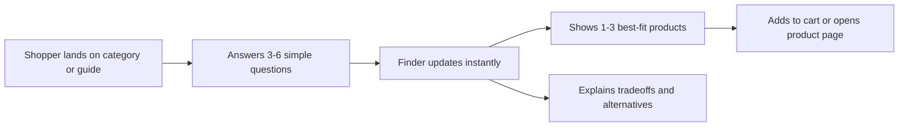

# Interactive Product Finder — Revised Plan

Status: pre-build planning. First WordPress plugin project; build will happen primarily in Claude Code.

## 1. Product summary

A Gutenberg-native product finder for WooCommerce block-theme stores that helps shoppers narrow a high-consideration catalogue to the right few products, instantly and transparently.

First case: **"Find your tent"** — independent outdoor-gear retailers with 20–150 tents/accessories on WooCommerce. Shopper answers 3–6 questions, sees 1–3 matching tents update live, with an honest explanation of the match, and can add to cart or open the product page.

Upstream of a possible future comparison block ("which of these 3 is right for me?"), but launches as its own product, not bundled.

## 2. Target market & validation (new)

Before writing the recommendation engine or the attribute-mapping UI, size and sanity-check the market — this is the part of the original plan most likely to be wrong, and it's cheap to check early:

- **Size the real addressable segment.** WooCommerce + block theme + 20–150 SKU high-consideration catalogue is a narrow intersection. Block-theme adoption among WooCommerce stores is still a minority relative to classic themes/Elementor/Divi/Astra. Before committing to "block-theme only," check WordPress.org theme stats or a sample of outdoor-gear WooCommerce stores to see how many are actually on block themes today. If the number is small, decide now whether v1 still targets block themes only (cleaner Interactivity API story, smaller market) or needs a classic-theme fallback later.
- **Talk to 5–10 outdoor-gear retailers or the agencies that build for them** before or during MVP build — not a formal study, just enough to confirm the "which tent?" support burden is real and that they'd trust a rule-based (not AI) explanation. This can happen in parallel with early coding, not as a gate.
- **Check attribute hygiene on real stores.** Look at a handful of actual outdoor-gear WooCommerce catalogues (or your own seed data) for whether `capacity`, `packed_weight`, `season_rating`, `use_type` already exist as consistent attributes. This determines how much onboarding-assist work is really needed (see §5c).

## 3. Customer and job to be done

Buyer: owner, ecommerce manager, or agency serving a WooCommerce merchant.

Job to be done: when a shopper is overwhelmed by similar products, help them confidently find the right option before they leave or contact support.

Merchant outcomes: more category-page engagement, higher add-to-cart/purchase conversion, lower "which one should I buy?" support burden, fewer unsuitable purchases/returns, better visibility into what shoppers actually want.

## 4. Product experience

The default product grid remains useful before interaction. The Finder enriches it rather than replacing the merchant's catalogue or relying on an external iframe.

Visitor-facing components: progress indicator; single-question cards (image choice, radio, range, toggle); "skip" on nonessential questions; immediate top recommendations; "why this fits" explanation; product cards with price/stock/key specs/CTA; "compare the top choices" link; reset button; mobile-friendly, keyboard-accessible layout.

## 5. Scope decisions (resolving open questions from the original draft)

### a) Lead capture: permanently excluded, not just deferred

The original draft listed "no lead capture" both as core differentiation *and* as an MVP-phase exclusion, which pointed in two directions at once. Resolving it: **no lead capture, ever, in the Finder itself.** This is a positioning commitment, not a sequencing one — "product-fit first" is the wedge against RevenueHunt-style quiz tools built around lead gen, and it only holds if it's permanent. If a merchant wants CRM capture, that's a different product (or a future integration point at the "add to cart" event, not inside the finder flow). Aggregate, non-PII reporting can still live in the later Finder Insights tier.

### b) Category scope: one finder block instance per category, not "one category total"

"One category at a time" read like an artificial cap that would make the first upsell (a second category) feel like a paywall rather than real value. Resolution: the free plugin supports **multiple Finder block instances**, each configured for one category — a merchant can place a Tents finder on one page and a Sleeping Bags finder on another, each set up separately. What's actually gated to premium is the *cross-category tooling*: shared templates beyond the one starter template, multi-step conditional paths, and any dashboard that manages many finders at once. This keeps the free tier honestly useful for a real multi-category store without pulling forward the harder conditional-logic work.

### c) Attribute hygiene: treat as a free-tier onboarding problem, not a premium analytics feature

The merchant workflow assumes clean attributes (`packed_weight`, `season_rating`) already exist. Most stores won't have them. If mapping is the first thing a new merchant hits and their catalogue isn't ready, they'll bounce before ever seeing the finder work. Add to MVP:
- A **mapping screen that shows completeness per attribute** ("42 of 61 tents have packed weight set") so the gap is visible immediately, not discovered later.
- The starter template ships with the expected attribute taxonomy for tents pre-defined, so merchants are filling in values, not inventing structure.
- Keep the deeper "product-data completeness audit" (trends over time, alerts) in Finder Insights — the *one-time-at-setup* visibility is free-tier; ongoing monitoring is the paid add.

### d) Recommendation model: explicit rule spec, not just an example table

"Rule-based filtering and ranking" needs a real spec before it's buildable. Minimum for MVP:
- Each question maps to one attribute with a declared type: **hard filter** (must match, e.g. `capacity >= 4`) or **soft preference** (weighted, e.g. `use_type = backpacking`).
- Ranking = filter catalogue by all hard filters → score survivors by sum of matched soft-preference weights → sort descending → take top 3.
- **Fallback rule:** if zero products survive all hard filters, drop hard filters one at a time in merchant-defined priority order (e.g. relax budget before relaxing capacity) until at least one product qualifies, and surface exactly which constraint was relaxed in the "why this fits" text ("No tent meets every preference — this is the lightest 4-person option within 10% of your budget").
- Tie-breaking: stable sort by a merchant-set default (e.g. price ascending) so results don't jitter between reloads.

This is small enough to build directly but needs to be decided before coding the state logic, not discovered mid-implementation.

## 6. Merchant workflow (revised)

1. Install plugin, connect WooCommerce.
2. Choose a category (e.g. Tents) and a starter template ("Outdoor Gear Finder").
3. See attribute-completeness summary for that category before mapping (§5c).
4. Map WooCommerce attributes to finder attributes: capacity, packed weight, season rating, use type, price band.
5. Customize the questions (up to 6).
6. Set each question as hard filter or soft preference, and set fallback-relaxation order (§5d).
7. Review recommendation rules in plain language (auto-generated from the mapping, e.g. "Products must match capacity. Products are preferred if they match use type and season rating.").
8. Insert the Finder block on a category page, landing page, or buying guide.

WooCommerce stays the source of truth — no duplicated product name, price, image, stock, or URL.

## 7. Why the Interactivity API fits

Front-end, stateful block: answers update local state; recommendations, count, explanations, and CTAs react immediately with no per-answer AJAX request. PHP block render supplies a functional initial category view; only the selected category's relevant product data enters the browser. This is exactly the case the Interactivity API is built for (instant search, cart-like reactive UI).

## 8. MVP scope

- Free WordPress.org plugin, WooCommerce required.
- Product Finder block, supporting multiple instances (one per category, §5b).
- Up to six questions per finder, each declared as hard filter or soft preference.
- Attribute mapping with completeness visibility at setup (§5c).
- Rule-based matching per the spec in §5d, including fallback/relaxation logic.
- Immediate on-page results, "why this fits" text.
- Add-to-cart and product-page actions.
- Basic local aggregate event counts (no PII, no external tracking).
- One starter template: Outdoor Gear Finder (Tents).
- Full accessibility and no-JavaScript fallback (server-rendered initial grid still works).

**Deliberately excluded (still, and lead capture is permanent — see §5a):** lead capture, email/CRM integrations, AI-generated questions, cross-category dashboard/multi-category management, external behavioral tracking, advanced multi-step conditional branching, cross-sell optimization, third-party data feeds.

## 9. Testing strategy — TDD (new)

TDD works cleanly on some layers of this plugin and only loosely on others. Be deliberate about which is which rather than trying to force strict red-green-refactor everywhere:

**Strict TDD (write the failing test first, always):**
- The **rule/matching engine** (§5d) — hard filters, soft-preference scoring, fallback relaxation, tie-breaking. This is pure input→output logic with zero WordPress dependency, which makes it the single best-suited piece of this whole plugin for TDD, and it's also the piece most worth getting right (it's the product). Write it as a plain PHP class with no `WP_*` calls at all, so tests run under plain PHPUnit with no WordPress bootstrap — fast feedback loop, no fixtures beyond arrays.
- The **attribute-completeness calculation** (§5c) — also pure: given a set of products and a target attribute list, return counts/percentages. Same treatment.
- If the matching logic ends up duplicated in JS for the Interactivity API (§9 step 5 below), write **one shared fixture file** of `{inputs, expected output}` cases (plain JSON) and run it against both the PHP suite and the JS suite. This turns the PHP/JS drift risk already flagged in §12 into something a CI run catches automatically instead of something a merchant discovers.

**Test-after-scaffold (write the test as soon as the harness exists, before the next behavior):**
- Block registration, the server-side render callback, and the attribute-mapping admin screens. You can't meaningfully test-first "does WordPress invoke my render callback" before any WordPress integration exists — but once `wp-env` + a `WP_UnitTestCase` bootstrap is running, every new behavior added to that glue code should still get a test before the next one is added. Use `WP_UnitTestCase` (via wp-env's PHPUnit support) for anything touching WooCommerce product queries or WordPress hooks.
- Interactivity API store actions/derived state — test as pure functions wherever the logic can be pulled out of DOM-touching code; keep the DOM-touching remainder thin enough that it doesn't need much direct testing.

**Thin coverage, checked manually or via a handful of e2e runs, not unit-tested exhaustively:**
- Visual/markup output of block editor UI, exact CSS, admin screen layout. Use `@wordpress/e2e-test-utils-playwright` against `wp-env` for a small number of critical-path scenarios (answer questions → see filtered results update → add to cart; zero-match fallback triggers and explains itself) rather than trying to unit-test markup.

**Toolchain:**
- PHP: PHPUnit, run via `wp-env`'s built-in test environment (`wp-env run tests-cli --env-cwd=wp-content/plugins/<plugin> phpunit`). Keep the pure rule-engine tests runnable without wp-env at all (plain `phpunit` on a WordPress-free class) for fast local iteration.
- JS: Jest via `@wordpress/scripts` (`wp-scripts test-unit-js`), which comes preconfigured when the block is scaffolded with `@wordpress/create-block`.
- E2E: `@wordpress/e2e-test-utils-playwright` for the small set of full-flow scenarios above.

## 10. Suggested build order (first WordPress plugin — sequenced for TDD, not just features)

Given this is a first plugin, a first WooCommerce integration, and a first TDD project, sequence so the earliest steps are the ones best suited to test-first — that builds the TDD habit on the easy, WordPress-free part of the codebase before WordPress's own complexity is in the mix:

1. **Environment & scaffolding.** Local WordPress + WooCommerce dev site (`wp-env`, Local, or WP Engine's Studio — pick one and stick with it). Scaffold the block with `@wordpress/create-block` using a dynamic (server-rendered) block. Get `wp-scripts test-unit-js` and PHPUnit both running (even against a trivial placeholder test each) before writing any real code, so the red-green loop is available from the start.
2. **Rule engine, test-first, no WordPress involved.** Before touching a single WordPress hook: write the fixture cases from §5d (hard filter, soft-preference scoring, fallback relaxation, tie-break) as PHPUnit tests against a plain PHP class, red before green, one rule at a time. Do the same for the attribute-completeness calculation (§5c). This is the actual TDD-practice step — small, fast, no framework noise.
3. **Seed data.** Create or import ~20–30 sample tent products with the target attributes set, so later steps have something real to run against.
4. **Static skeleton.** Get the block inserted on a category page, server-rendering a hardcoded list of 3 tents from real WooCommerce product data (no questions yet), backed by a `WP_UnitTestCase` integration test that asserts the render output contains the expected products. This validates the WooCommerce data access + block rendering pipeline — the part most likely to have first-timer friction — with a safety net already in place.
5. **Wire the tested rule engine into the server render.** Replace the hardcoded list with real calls to the engine from step 2, using seed data. Existing engine tests already cover correctness; add integration tests only for the wiring itself (does the render callback pass the right inputs, does it handle zero-match).
6. **Interactivity API wiring.** Wire questions → local state → client-side re-render, calling the same matching logic. Decide explicitly here whether the JS side reimplements the engine (mirror the shared fixture file from §9) or the PHP engine is exposed via a lightweight endpoint the client calls — write that decision down, since duplicated logic without shared fixtures is exactly how the two drift.
7. **Attribute mapping UI + completeness view.** Build the admin screen that lets a real merchant map their own attributes, backed by the already-tested completeness calculation from step 2. Scoped to attribute mapping only — see §13 for the question-customization boundary this step deliberately doesn't cover yet.
8. **Starter template packaging, accessibility pass, no-JS fallback**, plus the small Playwright e2e suite from §9.
9. **Basic local event counts.**

## 11. Differentiation (unchanged, still holds)

| Existing category norm | Product Finder wedge |
|---|---|
| Standalone quiz or shortcode | Native Gutenberg block |
| Result shown after final question | Results update immediately |
| Opaque quiz logic | Merchant-controlled, explainable matching |
| Hosted quiz data by default | Local WooCommerce data by default |
| Generic form builder workflow | Vertical buying-guide templates |
| Lead capture as the primary goal | Product-fit and purchase confidence first (permanently, §5a) |

WooCommerce's own Product Recommendations extension has noted block-theme limitations — a real compatibility opportunity, not a guaranteed whitespace (§2).

## 12. Monetization

**Free core:** one finder block (multi-instance, §5b), transparent rule-based logic, WooCommerce mapping, local product data, one starter template.

**Premium local add-on:** additional vertical templates (Home Office, Specialty Coffee, Pet Supplies), more question types, multi-step conditional paths, finder styling/brand controls, comparison handoff, advanced local conversion reporting.

**Later hosted service — Finder Insights:** consent-aware path analytics, question drop-off analysis, product-result performance reporting, recommendation change history, automated no-result/weak-match alerts, ongoing product-data completeness audits, optional AI-assisted attribute normalization (explicit merchant consent). This is the most defensible long-term value ("shoppers who need a 4-person backpacking tent most often abandon at the price question; your catalogue has no strong match below $400") — sequence it last, after the free product has real usage data to build it against.

## 13. Open risks to keep watching during build

- TAM ceiling from the block-theme requirement (§2) — revisit after early merchant conversations.
- PHP/JS rule-logic duplication (§10 step 6) — mitigated by the shared-fixture testing approach in §9, but only if it's actually kept up as both sides evolve.
- Whether "one starter template" is enough to get any real merchant to install and finish setup, given attribute mapping is real work even with completeness visibility.
- No go-to-market plan yet (WordPress.org SEO, agency partnerships, outdoor-gear-specific channels) — fine to defer past MVP, but shouldn't be forgotten past it.
- Shared-engine relationship with a future comparison block is asserted, not architected. If that's still a real intention, keep the attribute-mapping data model generic enough now that a comparison block could reuse it later without a rewrite — but don't build the comparison block itself yet.
- **Question customization is narrower than §6 describes, for now.** §6 step 5–6 ("customize the questions... set each question as hard filter or soft preference, and set fallback-relaxation order") implies a real per-question editing UI. Build order step 7 deliberately covers attribute mapping + completeness only — `TentsTemplate`'s questions, hard/soft types, weights, and relaxation order stay hardcoded. Editing hard/soft type means a mini rule-builder UI (comparator, weight, threshold), which is a meaningfully bigger scope than mapping and was deferred rather than folded into step 7. Worth deciding explicitly later whether this becomes its own build-order step or stays deferred toward the premium "more question types" tier (§12) — right now it's just unscoped, not a made decision either way.
